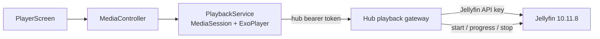

# Video player implementation plan

## Goal

Build a native, controller-first Jellyfin video player for movies and episodes. The target is the useful playback feature set people expect from Findroid and mature Jellyfin clients: direct play, remux and transcode fallback, resume state, track selection, chapters, trickplay, intro/credits skipping, next episode, quality control, Picture-in-Picture, and accurate Jellyfin session reporting.

This plan covers local movie and episode playback first. Offline playback, casting, SyncPlay and Live TV build on the same playback contract after local playback is stable.

## Current status — first release delivered 2026-09-08

The native first release is implemented, deployed and verified on the Pocket DS. It includes:

- controller-first full-screen Media3 playback owned by a `MediaSessionService`;
- movie and episode Play/Resume, Start over and pre-play options; smart series Resume/Next/Start targets;
- consistent detail-first navigation: A opens movies, episodes and series from Home, Library and season rows, and playback starts from the item's icon action;
- runtime capability probing, Jellyfin PlaybackInfo negotiation, Original/40/20/10/5/2 Mbps quality, media versions, audio and subtitle selection, and semantic track preferences;
- session-bound byte-range, HLS and external-subtitle proxying with no Jellyfin credentials or raw upstream URLs exposed;
- 10-second and immediate lifecycle/seek/track/exit event reporting, 30-minute abandoned-session cleanup, one-shot compatible-transcode fallback, and a 15-second next-episode countdown;
- compact Audio/CC/Quality/PiP/Close controls, configurable short seek buttons, adjacent-episode buttons and native Android PiP;
- exact origin screen and focus restoration after playback.

The live Android 13/Jellyfin 10.11.8 run rendered H.264 video, converted E-AC-3/AC-3 to AAC through HLS, loaded external SRT, paused and resumed, used the short seek controls, paused on ordinary backgrounding, retained playback in native PiP and closed the transcode on exit. Timeline previews now use generated Jellyfin trickplay when available and a session-bound ffmpeg frame fallback otherwise. The remaining player work starts with chapters and media-segment skipping, followed by subtitle appearance, speed/aspect controls, expanded diagnostics, PiP remote actions/platform controls and offline playback.

## Technical decision

Use AndroidX Media3 ExoPlayer as the primary engine.

- It uses Android's hardware decoders, supports HLS and direct files, exposes track selection and MediaSession integration, and can preserve native HDR when the device supports the stream.
- The Pocket DS runs Android 13. Its main 1920×1080 display advertises HDR10 and HLG; its second display is SDR. The player must build the Jellyfin device profile from the active display and actual decoder capabilities.
- Jellyfin 10.11.8 is installed, so trickplay and media segments are available at the server level.
- Unsupported codec, container, audio-channel or subtitle combinations fall back through Jellyfin remux/direct-stream/transcode. A second embedded playback engine is unnecessary for the first release.
- Keep an optional mpv/libass investigation behind a `PlayerEngine` boundary. Add it only if tests find common local files that Jellyfin fallback cannot handle well, or if full ASS rendering and subtitle/audio delay justify the APK size, native-code maintenance and licensing cost. Do not make users choose an engine for ordinary playback.

Findroid remains the interaction benchmark. Its current feature list includes ExoPlayer and mpv, PiP, chapters, trickplay, and media-segment skipping, but it explicitly describes playback as direct-play only. This player will retain those useful controls and add server negotiation.

## Architecture

Keep `HubActivity` as the only Activity and push a full-screen `PlayerScreen` onto the current section stack. This preserves the one gamepad pipeline and makes Back return to the exact focused Home or Library item.

The actual `ExoPlayer` and `MediaSession` live in a `MediaSessionService`. `PlayerScreen` connects through a `MediaController` and attaches the service's video output to a `PlayerView`. The service survives temporary UI detachment. Normal backgrounding pauses video and retains the session for return; explicit native PiP keeps playback attached. Notification controls and optional background audio are later milestones.

`HubApi` remains the app's only network boundary. The app never receives the Jellyfin API key or a raw upstream URL. The hub owns playback negotiation, forwards byte ranges without buffering the whole file, rewrites HLS resources, and reports the configured user's session state to Jellyfin.

## Hub contract

Add authenticated endpoints under the existing `play` scope. IDs are opaque and bound to the caller's token and configured Jellyfin user. Playback sessions live in memory, expire after inactivity, and never permit arbitrary upstream URLs.

| Endpoint | Purpose |
|---|---|
| `GET /v1/library/series/{seriesId}/play-target` | Resolve the selected user's resumable, next or first available episode. |
| `POST /v1/playback/items/{itemId}/prepare` | Validate the item, accept measured device/display capabilities and preferences, call Jellyfin PlaybackInfo, and return a normalized playback plan. |
| `GET /v1/playback/sessions/{sessionId}/stream` | Range-capable direct-file or remux proxy for Media3. Preserve `Range`, `If-Range`, length, type and seek headers. |
| `GET /v1/playback/sessions/{sessionId}/hls/{resource}` | Proxy only resources registered for that session and rewrite every manifest/segment/subtitle URI back through the hub. |
| `GET /v1/playback/sessions/{sessionId}/subtitles/{trackId}` | Proxy one approved external or extracted text subtitle track. |
| `POST /v1/playback/sessions/{sessionId}/select` | Change source, quality, audio or subtitle selection. Re-negotiate when the choice changes the Jellyfin stream. |
| `POST /v1/playback/sessions/{sessionId}/events` | Forward started, progress, paused, unpaused and stopped state with position, play method, stream indices and volume/mute state. |
| `DELETE /v1/playback/sessions/{sessionId}` | Send a final stop, close any live/transcode stream and release the hub session. Idempotent. |

The prepare response contains:

- item, media-source and play-session IDs;
- one hub media URL and its MIME type;
- play method: direct play, direct stream, remux or transcode;
- resume position and runtime;
- selectable audio, subtitle and video/source tracks, including language, title, codec, channel layout, forced/default/SDH flags and external delivery URLs;
- next episode metadata when applicable;
- the effective bitrate, resolution, frame rate, HDR mode and transcode reason.

The adapter constructs Jellyfin's `DeviceProfile` from a small validated capability model sent by the app. It enables direct play, direct stream and transcoding and lets Jellyfin select the safest plan. Never trust a client-supplied upstream path, media source, codec string or playback URL without matching it to the PlaybackInfo response.

Streaming responses bypass the JSON cache and Go response-size limit. Copy data incrementally, propagate cancellation, use conservative idle timeouts, and stop the upstream transcode when the client session closes. A direct stream must not be read into memory before responding.

## Player behavior

### Start and resume

- Movie and episode detail screens expose icon actions for **Play/Resume**, **Start over**, **Playback options**, watched state and favourite state. A opens Continue Watching, Next Up and episode-row items in Details first; a resumable item shows its resume time beside the Play symbol.
- Resume is automatic when at least 30 seconds were watched and more than 30 seconds remain. Detail pages keep **Start over** separate.
- Start with the user's saved audio/subtitle language preferences, while respecting Jellyfin default and forced flags.
- Keep the old screen visible while prepare runs. On failure show a retryable message without losing focus.

### Controller and touch controls

- **A:** play/pause; activates a focused overlay control.
- **Left/Right:** traverse visible controls; when the timeline is focused, seek by the configured step.
- **L2/R2:** back/forward by the configured 5/10/15/30-second seek step (10 seconds by default).
- **X:** audio and subtitle sheet.
- **Start/Menu:** player options and playback information.
- **B:** close an open sheet, then hide controls, then exit playback. Exiting reports the latest position before restoring the prior content focus.
- **Android Back/edge gesture:** exit playback immediately and restore the originating screen.

Touch exposes the same actions. The overlay uses large targets, the existing colors and in-layout sheets. Controls hide after about three seconds of uninterrupted playback and reappear on any pointer or controller input.

Double-tap the left or right side to seek by the selected short-seek interval. Horizontal dragging scrubs relative to the starting position, moves the visible timeline thumb and shows a small preview over the destination with target time and signed delta. Timeline dragging shows the destination time and frame without a delta. Vertical dragging controls brightness on the left side and media volume on the right side, with a percentage bar that follows the changed level.

### Implemented first-release feature set

- play/pause, buffered timeline, frame-accurate-enough seeking, elapsed/remaining time and loading/error state;
- direct play, remux/direct stream and server transcode with an **Original** quality option plus bitrate presets;
- mid-playback audio and subtitle selection, subtitles off, forced/default handling, external Jellyfin subtitles, and preference memory by language;
- external SRT/WebVTT timing offsets use a live ±60-second on-video bar, 0.1-second fine steps and
  one-second trigger steps. The subtitle is parsed once and its local cue clock moves without
  reloading video or subtitle data. The compact panel has focusable Reset and Done actions, and
  saves timing locally per Jellyfin user and series (or per movie);
- touch double-tap seeking, horizontal scrubbing, brightness/volume gesture bars and Jellyfin trickplay previews with a session-bound ffmpeg frame fallback when no tile exists;
- automatic next-episode countdown with Cancel and Play now, while reporting Stop for the old item before Start for the new one;
- previous/next episode buttons sourced from Jellyfin's adjacent episode window, plus native Android PiP that stops cleanly when dismissed;
- HDR capability reporting and Jellyfin fallback when the active display or decoder cannot accept the source;
- a playback-info panel showing play method, output codecs, resolution, bitrate, frame rate and HDR mode;
- foreground lifecycle pause/return with the same session and exact focused-content restoration.

Chapters, intro/recap/credits skipping, subtitle appearance, playback speed, aspect modes, expanded diagnostics, PiP remote actions/automatic entry, notification/headset controls, optional background audio, offline downloads and fully faithful ASS/libass rendering are explicit follow-ups.

## Delivery phases and status

Each phase ships hub support before app support.

### P0 — playback probe and contract — delivered

1. Capture PlaybackInfo for representative H.264, HEVC 10-bit HDR, AV1, multichannel audio, ASS, PGS, external subtitles, movie and episode files on this server.
2. Enumerate the Pocket DS codecs at runtime and test both displays.
3. Implement the normalized models, device-profile builder and URL allowlist with adapter/handler tests.

Exit: a command-line test can prepare every sample and explain Direct Play, Remux or Transcode without exposing the Jellyfin key.

### P1 — dependable playback — delivered

1. Add the range/HLS gateway and Jellyfin start/progress/stop reporting.
2. Add Media3, `PlaybackService`, the full-screen `PlayerScreen`, resume/start-over, play/pause, seeking and error recovery.
3. Connect Movie and Episode details, then Home cards.

Exit: a movie and an episode play from start or resume, survive pause/resume, update Continue Watching on another Jellyfin client, and fall back to transcode when direct playback is rejected.

### P2 — tracks and quality — core delivered

1. Add source, audio, subtitle and bitrate selection with preference memory.
2. Add external subtitles. Subtitle appearance controls move to the next polish milestone.
3. Preserve position while a change requires stream renegotiation.

Exit: audio/subtitle/quality can change during playback across direct and transcoded samples without losing the user's place.

### P3 — polished episode viewing — next episode and trickplay UI delivered; polish remains

1. Trickplay scrub previews are delivered; generate server tiles, then add chapters and media-segment skip/auto-skip.
2. Add next-episode queue, countdown and lightweight preload of the negotiated next item.
3. Add speed, aspect modes, playback-info diagnostics and recoverable direct-play-to-transcode fallback.

Exit: a full season can be watched without returning to Library, with correct progress on every episode.

### P4 — PiP and platform integration — basic PiP delivered; platform polish later

1. Activity PiP transitions are delivered; add custom remote actions and optional automatic entry.
2. Complete MediaSession notification/system controls, headset events and audio focus.
3. Test process recreation, network changes, both displays and background/foreground transitions.

### P5 — extended Jellyfin playback — later

- Pocket DS offline downloads, local-first playback and deferred Jellyfin progress sync as specified
  in `OFFLINE_DOWNLOAD_PLAN.md`;
- Jellyfin remote-session casting and, separately, Chromecast where available;
- SyncPlay through Jellyfin's websocket/session protocol;
- Live TV/recordings and playlists after their Library surfaces exist;
- optional mpv/libass engine based on measured format gaps, with Media3 retained for native HDR.

## State and failure rules

- Model prepare, ready, buffering, playing, paused, ended and failed as pure Kotlin state. Generation IDs ignore late prepare/track-selection responses.
- Persist only safe semantic track preferences. Hub sessions and stream URLs remain in memory; never persist a stream URL or Jellyfin key.
- Send progress through one ordered actor every 10 seconds and immediately on pause, seek, track change, exit and completion. A final stop remains best effort if the network disappears.
- On source failure try the next server-approved plan once. Do not loop between direct play and transcode.
- Home, movie/episode details, series play targets and loaded episode rows refresh after playback exits while preserving their focus and scroll state. A two-minute, per-user local checkpoint bridges Jellyfin's propagation delay so an immediate Resume starts at the position just reported; Jellyfin remains authoritative after that window, and Start over never consumes the checkpoint.

## Validation

### Automated

- Go: device-profile mapping, PlaybackInfo shapes, source selection, invalid IDs, play-scope auth, session ownership/expiry, range forwarding, HLS rewriting, cancellation, transcode cleanup, event ordering and upstream failures.
- Pure Kotlin: resume rules, seek clamping and preview-frame math, quality choices and next-item countdown, plus existing navigation paging/focus state.
- Android build and on-device integration: HLS manifests/segments, external subtitle loading, controller sheets/seeking, event reporting, background pause/return and cleanup.

### Hardware/server matrix

- H.264 SDR, HEVC 8/10-bit, HDR10, HLG, AV1 and one unsupported video profile;
- AAC, AC-3/E-AC-3, DTS family, TrueHD and stereo/downmix cases;
- SRT, WebVTT, ASS, PGS, forced, SDH and external subtitles;
- MKV and MP4 direct play, remux, audio-only direct stream, full video transcode and tone-mapped transcode;
- movie resume, episode resume, watched threshold, intro/credits, trickplay, next episode and Specials;
- upper HDR screen, lower SDR screen, wired/Bluetooth audio, Wi-Fi loss, hub restart, app backgrounding, PiP and process recreation;
- local `adb reverse` and the configured HTTPS hub route, including sustained high-bitrate playback.

## Sources used for the decision

- [Findroid feature list and player support](https://github.com/jarnedemeulemeester/findroid)
- [Jellyfin playback types and transcoding negotiation](https://jellyfin.org/docs/general/post-install/transcoding/)
- [Jellyfin client codec and subtitle behavior](https://jellyfin.org/docs/general/clients/codec-support/)
- [Jellyfin PlaybackInfo request model](https://github.com/jellyfin/jellyfin/blob/master/Jellyfin.Api/Models/MediaInfoDtos/PlaybackInfoDto.cs)
- [Jellyfin play-state controller](https://github.com/jellyfin/jellyfin/blob/master/Jellyfin.Api/Controllers/PlaystateController.cs)
- [Media3 supported formats and HDR behavior](https://developer.android.com/media/media3/exoplayer/supported-formats)
- [Media3 track selection](https://developer.android.com/media/media3/exoplayer/track-selection)
- [MediaSessionService background playback](https://developer.android.com/media/media3/session/background-playback)
- [Android Picture-in-Picture](https://developer.android.com/develop/ui/views/picture-in-picture)
